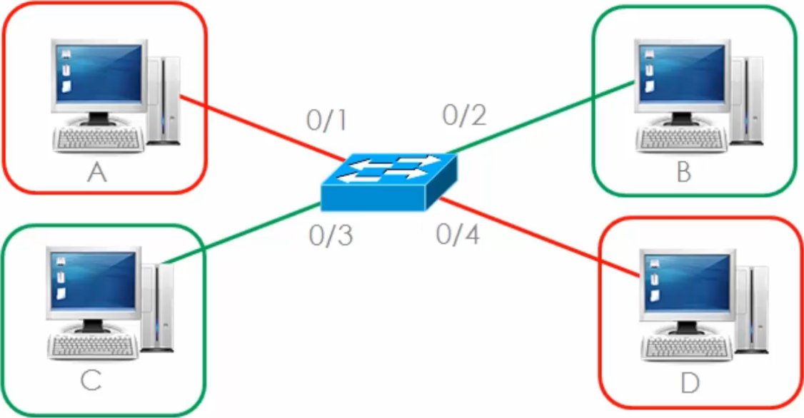

<a name="top"></a>
[Back to Main]()

# VLAN Concepts

---

## Introduction
VLANs (Virtual Local Area Networks) are a fundamental concept in networking that allow **network segmentation** without requiring separate physical infrastructure. This document provides an overview of VLAN concepts, their benefits, and their use cases.

[Back to Top](#top)

---

## What is a VLAN?
A VLAN is a **logical grouping** of devices within a network, allowing them to communicate as if they were on the same physical network, even if they are not. VLANs are implemented at the **data link layer (Layer 2)** of the OSI model.

[Back to Top](#top)

---

## Benefits of VLANs
* **Network Segmentation**
  * Reduces broadcast traffic and enhances performance.
  * Can separate users based on function (e.g., Sales &#8594; VLAN1 , Marketing &#8594; VLAN2).

* **Security**
  * Isolates traffic between groups to prevent unauthorized access.
  * Users have to traverse a Layer 3 device (e.g., Router) to get from one VLAN to another.

* **Flexibility**
  * Devices can be grouped based on function rather than physical location.
  * Move users from one VLAN to another without changing physical cabling.

* **Better Traffic Management**
  * VLANs help reduce congestion by segmenting network traffic.
  * Separate VLANs for IP Phones provides better QoS (Quality of Service).

[Back to Top](#top)

---

## Physical vs Logical Topology
### Physical Topology


### Logical Topology

Red VLAN and Green VLAN will need a Layer 3 device (i.e., Router) to communicate with each other.

---

### Physical Topology with Trunk


### Logical Topology with Trunk


[Back to Top](#top)

---

## Types of VLANs
1. **Default VLAN**: The initial VLAN present on a switch (usually VLAN 1).
2. **Data VLAN**: Used for carrying user-generated traffic.
3. **Voice VLAN**: Dedicated for VoIP traffic to ensure Quality of Service (QoS).
4. **Management VLAN**: Used for network management traffic.
5. **Native VLAN**: The VLAN assigned to untagged frames.

[Back to Top](#top)

---

## VLAN Tagging
- VLANs use tagging to identify traffic belonging to specific VLANs.
- **802.1Q** is the most common tagging protocol - this is the industry standard.
- Switches use VLAN IDs (VID) to distinguish between VLANs.
- **ISL** (Inter-Switch Link) is a Cisco-proprietary protocol - rarely used today.

### Standard Ethernet Frame
```
+-------------------+------------------------------------------+----------------------+--------------------+-----------------+
|  Destination MAC  |  Source MAC                              |  EtherType/Length    |     Payload        |     FCS         |
|  Address (6 bytes)|  Address (6 bytes)                       |  (2 bytes)           |   (46-1500 bytes)  |  (4 bytes)      |
+-------------------+------------------------------------------+----------------------+--------------------+-----------------+
```

### 802.1Q Frame
```
+-------------------+-------------------+----------+-----------+----------------------+--------------------+-----------------+
|  Destination MAC  |  Source MAC       |  802.1Q  |  VLAN Tag |  EtherType/Length    |       Payload      |       FCS       |
|  Address (6 bytes)|  Address (6 bytes)|  Tag     |  Control  |  (2 bytes)           |   (46-1500 bytes)  |    (4 bytes)    |
|                   |                   |       (4 bytes)      |  Information         |                    |                 |
+-------------------+-------------------+----------+-----------+----------------------+--------------------+-----------------+
```
1 byte   =  8 bits

4 bytes  = 32 bits
```
+----------+---------+---------+-----------+
|  TPID    |  PRI    |  CFI    | VLAN ID   |
| (2 bytes)| (3 bits)| (1 bit) | (12 bits) |
+----------+---------+---------+-----------+
```


[Back to Top](#top)

---

## Inter-VLAN Communication
By default, VLANs cannot communicate with each other. Inter-VLAN routing is required, which can be done using:
- **Router-on-a-stick**: A router with a trunk connection handling multiple VLANs.
- **Layer 3 Switches**: Switches with routing capabilities.

[Back to Top](#top)

---

## Conclusion
Understanding VLANs is crucial for network engineers and administrators. They provide security, efficiency, and scalability to modern networks. For practical implementation details, refer to the VLAN Configuration document.


[Back to Top](#top)

---

