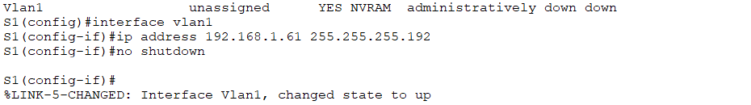
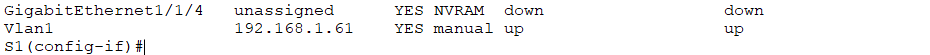
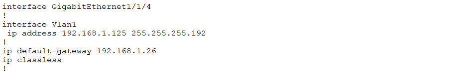
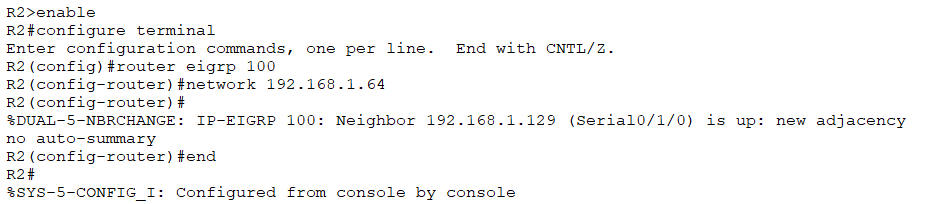
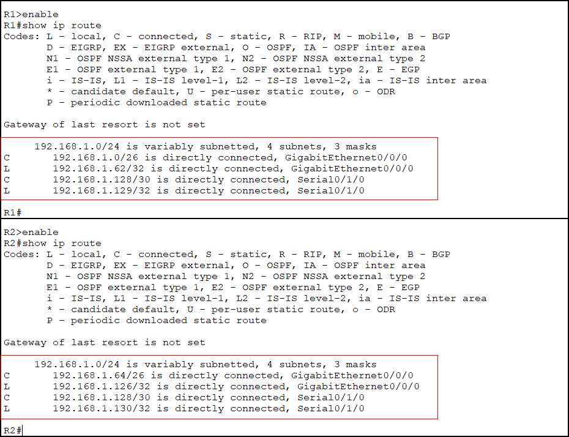

<a name="top"></a>
[Back to Main](https://github.com/caxylive/Net_Projects/tree/main)

# **Inter-Site Connectivity Using EIGRP in a Subnetted Network**

---

## Table of Contents
- [Introduction](#1-introduction)
  - [Technologies Used](#technologies-used)
- [Network Design](#2-network-design)
  - [Subnetting Scheme](#subnetting-scheme)
- [Device Configurations](#3-device-configurations)
  - [San Francisco Router (R1) and New York Router (R2) Initial Configuration](#san-francisco-router-r1-and-new-york-router-r2-initial-configuration)
  - [New York Router (R2)](#new-york-router-r2)
  - [San Francisco Switch (S1) and New York Switch (S2)](#san-francisco-switch-s1-and-new-york-switch-s2)
- [EIGRP Implementation](#4-eigrp-implementation)
  - [Configuration on R1 and R2](#configuration-on-r1-and-r2)
  - [Verification](#verification)
- [Testing and Validation](#5-testing-and-validation)
  - [Pre-EIGRP Routing Tables](#pre-eigrp-routing-tables)
  - [Pre-EIGRP Connectivity](#pre-eigrp-connectivity)
  - [Post-EIGRP Routing Tables](#post-eigrp-routing-tables)
  - [Post-EIGRP Connectivity](#post-eigrp-connectivity)
- [Conclusion](#6-conclusion)

---

## **1. Introduction**

This project demonstrates the implementation of **EIGRP** to establish dynamic routing between two geographically separated networks: San Francisco (`192.168.1.0/26`) and New York (`192.168.1.64/26`). Prior to EIGRP configuration, inter-site communication was unavailable due to the absence of routing protocol-driven route propagation. By configuring EIGRP, full connectivity was achieved, enabling seamless data transfer between sites.

---

### **Technologies Used**
- **Dynamic Routing**: EIGRP (Enhanced Interior Gateway Routing Protocol)
- **IP Addressing**: Subnetting, VLSM (Variable Length Subnet Masking), CIDR
- **Network Services**: DHCP, DNS (simulated)
- **Tools**: Cisco IOS, Cisco Packet Tracer

[Back to Top](#top)

---

## **2. Network Design**
### **Subnetting Scheme**
The `192.168.1.0/24` address space was subdivided as follows:
- **San Francisco LAN**: `192.168.1.0/26` (60 host addresses)
- **New York LAN**: `192.168.1.64/26` (60 host addresses)
- **WAN Link**: `192.168.1.128/30` (point-to-point serial connection)

  
*Logical topology showing subnets and device interconnections.*

  
*Subnet ranges and address assignments.*

[Back to Top](#top)

---

## **3. Device Configurations**
### **San Francisco Router (R1) and New York Router (R2) Initial Configuration**
#### **Interface Configuration**
| Description               | Command (R1)                                 | Command (R2)                               |
|---------------------------|----------------------------------------------|--------------------------------------------|
| Configure LAN Interface   | `interface GigabitEthernet0/0/0`             | `interface GigabitEthernet0/0/0`           |
| Assign IP Address         | `ip address 192.168.1.62 255.255.255.192`    | `ip address 192.168.1.126 255.255.255.192` |
| Bring interface up        | `no shutdown`                                | `no shutdown`                              |
| Configure WAN Interface   | `interface Serial0/1/0`                      | `interface Serial0/1/0`                    |
| Assign IP Address         | `ip address 192.168.1.129 255.255.255.252`   | `ip address 192.168.1.130 255.255.255.252` |
| Bring interface up        | `no shutdown`                                | `no shutdown`                              |
| Write changes from vRAM to nvRAM | `copy running-config startup-config`  | `copy running-config startup-config`       |

`show ip interface brief` shows the interfaces are not administratively down and are assigned with their respective IP addresses.

  
*Relevant interface command output on R1 and R2.*

---

### **New York Router (R2)**
#### **DHCP and DNS Configuration**

While devices in San Francisco will be assigned Static IPs, DHCP will be implemented for clients in New York R2.

| Description                                                |     Command (R1)   | Command (R2)                                           |
|------------------------------------------------------------|:------------------:|--------------------------------------------------------|
| Create a DHCP Pool                                         |        ---         | `ip dhcp pool NY`                                      |
| Specify the network range of the DHCP Pool                 |        ---         | `network 192.168.1.64 255.255.255.192`                 |
| Set the Default Gateway                                    |        ---         | `default-router 192.168.1.126`                         |
| Exclude a range of IP that will not be assigned to clients |        ---         | `ip dhcp excluded-address 192.168.1.125 192.168.1.127` |
| Specify the DNS server's IP address                        |        ---         | `ip name-server 192.168.1.126`                         |

`show running-config` should reveal the settings:

  
*DHCP pool setup and DNS configuration on R2.*

**Note**:
-  **DHCP Pool** enables the DHCP server to automatically assign IP addresseses based on this "pool" of addresses, reducing the workload and minimizing errors.
-  By excluding IP addresses (`ip dhcp excluded-address 192.168.1.125 192.168.1.127`), DHCP clients avoid getting assigned IP addresses of R2, S2, and broadcast IP.
- Use `default-gateway` on a router if the router is acting as a switch and its IP routing function is disabled.
- Layer 3 switches that can perform routing functions might use `default-router` in their DHCP settings to provide default gateway information to DHCP clients.
- R2 does not need `ip default-gateway` because it's a router, and routing protocols take care of forwarding traffic.
- In summary, use `default-gateway` for Switches and use `default-router` for Routers.
- In production environments, DNS is typically hosted on a **dedicated server**. Here, R2 simulates DNS resolution for **testing purposes**.

---

### **San Francisco Switch (S1) and New York Switch (S2)**
#### **Interface Configuration**
| Description               | Command (S1)                                 | Command (S2)                              |
|---------------------------|----------------------------------------------|-------------------------------------------|
| Configure LAN Interface   | `interface vlan1`                            | `interface vlan1`                         |
| Assign IP Address         | `ip address 192.168.1.61 255.255.255.192`    | `ip address 192.168.1.61 255.255.255.192` |
| Bring interface up        | `no shutdown`                                | `no shutdown`                             |
| Set Default Gateway       | `ip default-gateway 192.168.1.62`            | `ip default-gateway 192.168.1.126`        | 

We should be able to verify the configuration with `show ip interface brief`:
  
  
  
*Relevant verification output on S1 and S2.*

[Back to Top](#top)

---

## **4. EIGRP Implementation**
### **Configuration on R1 and R2**
| Description                                  | Command (R1)           | Command (R2)           |
|----------------------------------------------|------------------------|------------------------|
| Assign EIGRP to an AS number                 | `router eigrp 100`     | `router eigrp 100`     |
| Include what network EIGRP should advertise  | `network 192.168.1.0`  | `network 192.168.1.64` |
| Allow EIGRP to advertise subnets as they are | `no auto-summary`      | `no auto-summary`      |

  
  
*EIGRP setup for the San Fransisco and New York subnet (AS 100).*

**Note**:
- The Autonomous System (AS) number in the `router eigrp 100` command ensures that the EIGRP process is uniquely identified and allows for controlled exchange or routing information within the specified routing domain.
- By default, EIGRP autonatically summarizes routes at classful nework boundaries. This means EIGRP will summarize and advertise only the classful network address, potentially leading to inaccuracies in routing.
- For example, EIGRP might summarize and advertise subnets within the `192.168.1.0/24` network (such as `192.168.1.0/26` and `192.168.1.64/26`) as `192.168.1.0/24` → leading to incorrect routing.
- The `no auto-summary` command disables automatic summarization, ensuring that EIGRP advertises the specific subnets rather than summarizing them at classful boundaries → more accurate routing info.

---

### Verification

1. **Neighbor Adjacency**

The ```show ip eigrp neighbors``` command confirms successful adjacency between R1 and R2:
- Uptime increasing means that the adjacency is stable.
- `Q count = 0` means that there are no pending EIGRP updates waiting to be sent.


*Stable neighbor relationship indicated by increasing uptime and ```Q Count = 0```.*

---

2. **Routing Tables** <a name="verification-routing-tables"></a>

Post-EIGRP routing tables show EIGRP is correctly exchanging and installing routes between R1 and R2:
- The `D` EIGRP code appears in R1 and R2's routing table. This means that EIGRP is learning routes dynamically.
- San Francisco Subnet `192.168.1.0/26` is reachable via EIGRP from R2 through R1's Serial Interface `192.168.1.129/30`.
- New York Subnet `192.168.1.64/26` is also reachable via EIGRP from R1 through R2's Serial Interface `192.168.1.130/30`.

  
  *```D``` (EIGRP) routes for remote subnets, confirming route propagation.*

[Back to Top](#top)

---

## **5. Testing and Validation**
### **Pre-EIGRP Routing Tables**
The routing tables does not show any `D` EIGRP entries, which means that R1 **has not learned any routes** from R2 via EIGRP and vice versa. The only entries are for directly connected subnets (`C`) and local addresses (`L`), meaning R1 is not receiving updates from R2 and vice versa.

    

---

### **Pre-EIGRP Connectivity**
Devices can communicate locally (i.e., San Francisco devices can communicate among each other; New York devices can communicate among each other). However, inter-site pings failed due to missing routes ❌.

    
  *Ping from San Francisco to New York and vice versa **before** EIGRP configuration.*

---

### **Post-EIGRP Routing Tables**
Please revisit the [verification](#verification-routing-tables) section to view the results after the routing tables have been configured with EIGRP.

---

### **Post-EIGRP Connectivity**
- ✅ **Successful Inter-Site Pings**

    
  *Ping from PC1 (San Francisco) to PC2 (New York) after EIGRP convergence.*

---

- **Summary of Critical Tests**
  | Source          | Destination     | Result  |
  |-----------------|-----------------|---------|
  | PC1 (SF)        | PC4 (NY)        | Success |
  | R1 (SF)         | R2 (NY) WAN     | Success |
  | S1 (SF)         | S2 (NY)         | Success |
  | PC2 (SF)        | PC3 (NY)        | Success |  

> Full connectivity was validated across all devices.

[Back to Top](#top)

---

## **6. Conclusion**

EIGRP was successfully implemented to automate route propagation between the San Francisco and New York sites. Through dynamic routing, EIGRP enabled automatic route learning and sharing, eliminating the need for static routes. Key outcomes include simplified expansion to additional subnets, sub-second route updates during topology changes, and elimination of manual route maintenance. Future enhancements could include redundancy testing with backup links and comparisons with alternative routing protocols such as OSPF.

[Back to Top](#top)


