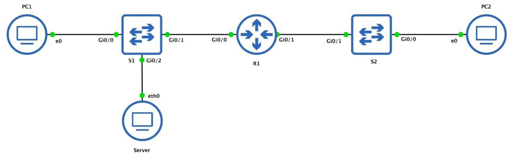
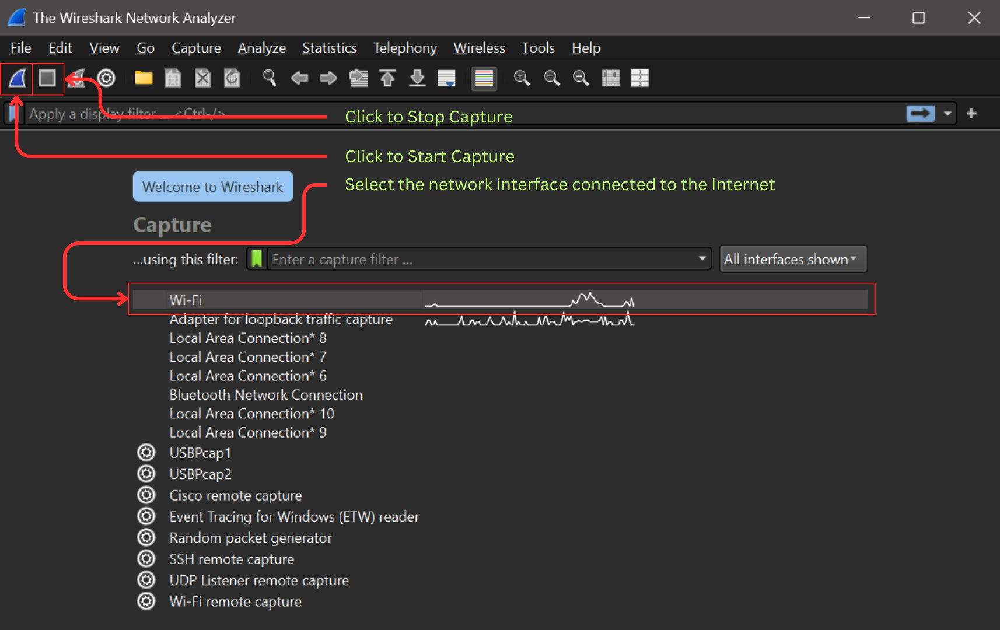
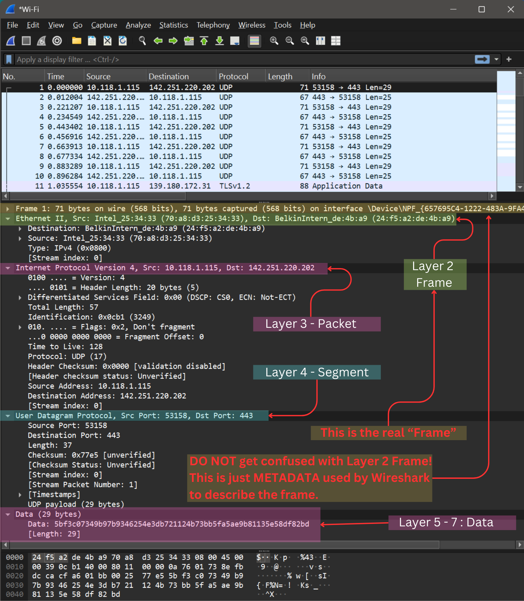
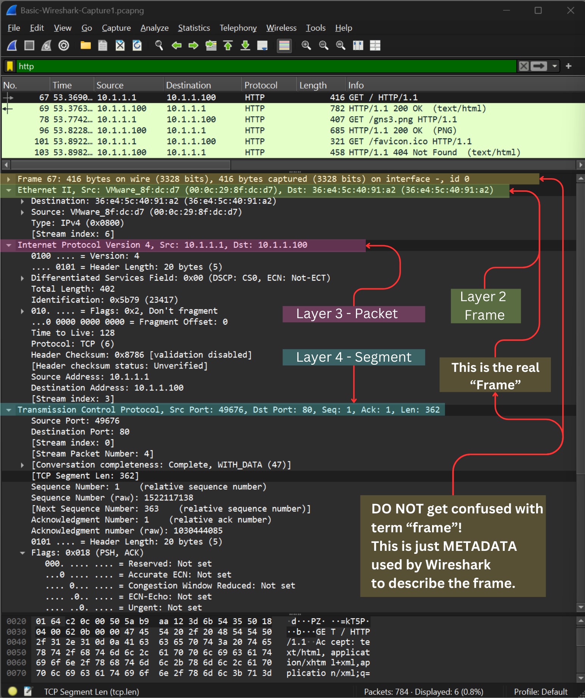
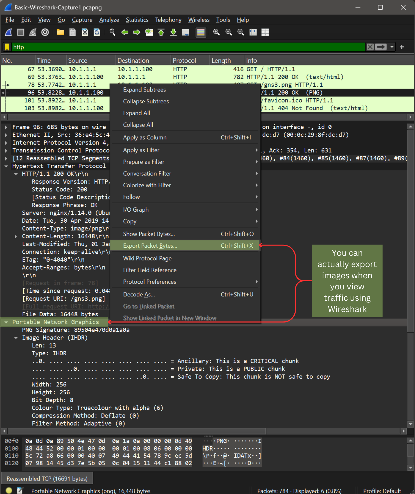

[Back to Main](https://github.com/caxylive/Net_Projects/blob/main/README.md)

# Wireshark Basics: Analyzing HTTP Traffic
---

Author: [Carl Xymon Verdejo](https://hardworking-lion-z4sd3b.mystrikingly.com/)

Contact: carl.xymon.verdejo@gmail.com

---

## Objective

This document outlines the process of capturing and analyzing HTTP traffic using Wireshark. The goal is to demonstrate the practical application of Wireshark for network traffic analysis and to reinforce key networking concepts.

[Back to Top](#top)

---

## Scenario

A basic network topology was established using GNS3, consisting of a PC (10.1.1.1) and a server (10.1.1.100) connected via a layer 2 switch. HTTP traffic was generated by accessing a webpage hosted on the server from the PC. Wireshark was used to capture and analyze the traffic between the PC and the switch.

[Back to Top](#top)

---

## How to Capture Traffic?

---

## Wireshark Basic Layout

---

## Capturing HTTP Traffic and Analysis

1.  **Traffic Capture:**
    * Wireshark was initiated to capture traffic on the link between the PC and the switch.
    * An HTTP filter was applied to isolate the relevant traffic.

2.  **Frame Analysis (Layer 2):**
    * Ethernet II frames were observed.
    * Source and destination MAC addresses were identified, confirming the communication between the PC and server.
    * The reversal of MAC addresses in the server's response was noted, demonstrating layer 2 switching behavior.

3.  **Packet Analysis (Layer 3):**
    * IPv4 packets were observed.
    * Source and destination IP addresses were identified, confirming the communication between 10.1.1.1 and 10.1.1.100.
    * The TCP protocol was identified within the IPv4 header.

4.  **Segment Analysis (Layer 4):**
    * TCP segments were observed.
    * Source and destination port numbers were identified (ephemeral port on the PC, port 80 on the server).
    * The TCP handshake and data transfer were observed.

5.  **Application Layer Analysis (Layer 7):**
    * HTTP GET requests from the PC to the server were observed.
    * HTTP 200 OK responses from the server were observed.
    * The HTML content of the webpage and the PNG image were identified within the HTTP data stream.
    * The clear text nature of HTTP traffic was demonstrated.

6.  **Data Extraction:**
    * The PNG image data was extracted from the HTTP response using Wireshark's "Export Packet Bytes" feature.
    * The extracted data was saved and renamed to a PNG file, confirming successful extraction.
    

[Back to Top](#top)

---

## Key Observations

* Wireshark effectively captured and displayed network traffic at various OSI layers.
* The analysis demonstrated the flow of data between the PC and server.
* The swapping of MAC and IP addresses in the return traffic confirmed layer 2 and layer 3 behavior.
* HTTP traffic was observed in clear text, highlighting potential security risks.
* Wireshark's data extraction capabilities were demonstrated.

[Back to Top](#top)

---

## Technical Skills Reinforced

* Wireshark traffic capture and filtering.
* OSI model layer analysis.
   * Layer 2 - Data Link
   * Layer 3 - Network Layer
   * Layer 4 - Transport Layer
   * Layer 5 - Session Layer
   * Layer 6 - Presentation Layer
   * Layer 7 - Application Layer
* Protocol analysis (Ethernet, IP, TCP, HTTP).
* Data extraction from network traffic.
* Understanding of layer 2 switching and layer 3 routing behavior.

[Back to Top](#top)

---

## Conclusion

This analysis provided a practical demonstration of Wireshark's capabilities for network traffic analysis. The process reinforced key networking concepts and demonstrated the importance of network visibility for troubleshooting and security. Future analysis will focus on more complex network scenarios and protocols.

[Back to Top](#top)
