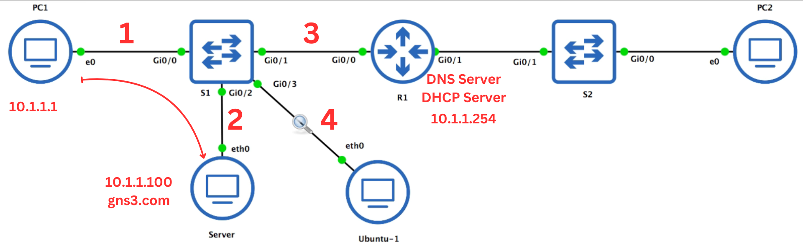
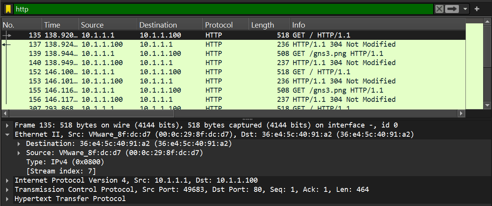
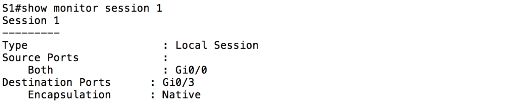
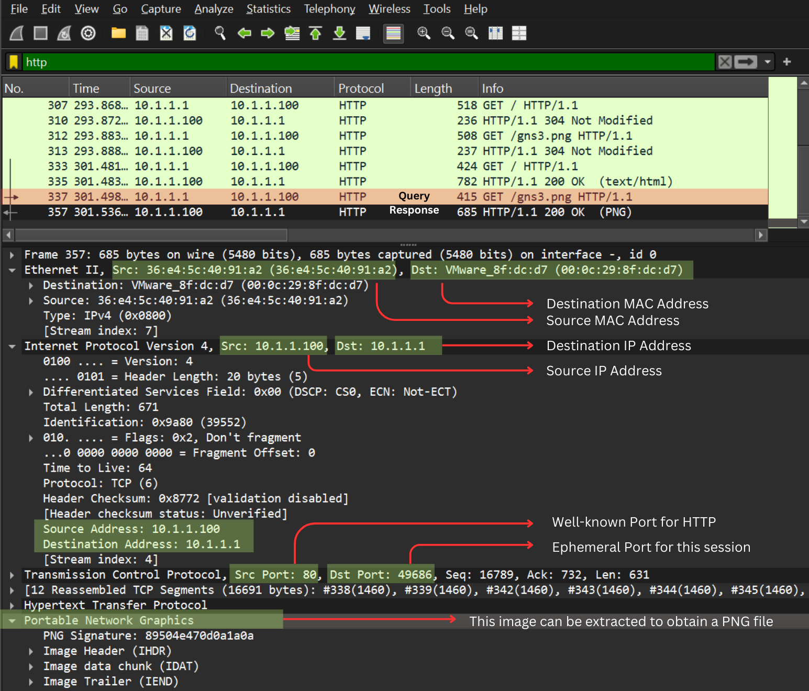

[Back to Main](https://github.com/caxylive/Net_Projects/tree/main/README.md)

---

# Wireshark Basics: Port Mirroring (SPAN) 

---

Author: [Carl Xymon Verdejo](https://hardworking-lion-z4sd3b.mystrikingly.com/)

Contact: carl.xymon.verdejo@gmail.com

---

# Table of Contents

1.  [Objective](#objective)
2.  [Scenario](#scenario)
3.  [Analysis and Observations](#analysis-and-observations)
4.  [Key Takeaways](#key-takeaways)
5.  [Technical Skills Reinforced](#technical-skills-reinforced)
6.  [Conclusion](#conclusion)
7.  [Sources](#sources)

---

## Objective

This document demonstrates how to use port mirroring (SPAN) to capture traffic between specific devices in a switched network. The video highlights the limitations of capturing traffic at arbitrary locations and the necessity of port mirroring for comprehensive network analysis.

[Back to Top](#top)

---

## Scenario

The GNS3 topology from [Project 004](https://github.com/caxylive/Net_Projects/tree/main/projects/004%20-%20Wireshark%20Basics%20-%20Analyzing%20HTTP%20Traffic/README.md) and [Project 005](https://github.com/caxylive/Net_Projects/blob/main/projects/005%20-%20Wireshark%20Basics%20-%20Traffic%20Flow%20and%20Capture%20Placement/README.md) is used. An Ubuntu PC (Ubuntu-1) is added to the topology to simulate a monitoring station. The goal is to capture HTTP traffic between the PC and server by using port mirroring.

[Back to Top](#top)

---

## Analysis and Observations

1.  **Initial Capture Failure:**
    * Capturing traffic on Link [3] (as done in [Project 005](https://github.com/caxylive/Net_Projects/blob/main/projects/005%20-%20Wireshark%20Basics%20-%20Traffic%20Flow%20and%20Capture%20Placement/README.md)) still fails to capture HTTP traffic between the PC and server.
    * This is because, in the previous project, the switch have already learned the MAC addresses of PC1 and the server.
    * And switches behave in such that they do not flood traffic to all ports once MAC addresses are learned.
   

---

2.  **Port Mirroring (SPAN) Configuration:**
    * **Switched Port Analyzer** (SPAN) is configured on the switch to copy traffic from Link [1] to Link [4].
    * The following commands are used:
        * `monitor session 1 source interface gigabit 0/0` 
        * `monitor session 1 destination interface gigabit 0/3`
    * This configuration copies all traffic from gigabit 0/0 (Link 1) to gigabit 0/3 (Link 4).

**Notes**:
  
   * **SPAN** is used to mirror traffic from one or more source ports or VLANs to a destination port for monitoring or analysis.
   * The session number (`1` in this case) is an identifier for the SPAN session, which allows you to configure and manage multiple SPAN sessions on the same device.
   * Each session is configured independently with its own sources and destinations.

---

3.  **Successful HTTP Traffic Capture:**
    * After configuring port mirroring, HTTP traffic between the PC and server is successfully captured on Link [4].
    * This demonstrates the effectiveness of port mirroring for capturing traffic between specific devices.

    

---

4.  **Verification of SPAN Configuration:**
    * The `show monitor session 1` command is used to verify the SPAN configuration.
    * This command displays the source and destination interfaces, as well as the encapsulation type.
    * Gig0/0 is connected to PC1
    * Gig0/3 is connected to Ubuntu-1
  
    

**Notes**:
   * "Native" encapsulation : the mirrored traffic sent to the destination port is transmitted in its original Ethernet format without any additional encapsulation.
      * This is the default setting on most Cisco devices for SPAN sessions.
      * The traffic appears exactly as it would if it were transmitted from its source interface.
   * **ERSPAN** (Encapsulated Remote Switched Port Analyzer) : mirrored traffic is encapsulated in a **GRE** (Generic Routing Encapsulation) tunnel
      * This allows the traffic to be sent across Layer 3 networks to a remote monitoring device.
      * This is useful for analyzing traffic over a broader network range, beyong the local switch.

---

5.  **HTTP Traffic Analysis:**
    * The captured HTTP traffic is analyzed in Wireshark.
    * The source and destination MAC addresses, IP addresses, and port numbers are examined.
    * The HTTP requests and responses, including the HTML content and PNG file, are observed.

    

---

6.  **Importance of Capture Placement:** 

    Capture placement in network analysis is critical because it directly determines the data you'll see. Here's a breakdown:

    * Switched Networks:
      * In a switched network, switches learn MAC addresses and forward traffic directly between the ports connected to the communicating devices.
      * This means that traffic intended for specific devices won't be broadcast to all ports.
      * Therefore, if you place your capture device on a port that isn't in the direct path of the traffic you want to analyze, you won't see that traffic.

    * Targeted Analysis:
      * Capture placement allows you to focus your analysis on specific segments of the network.
      * For example, if you're troubleshooting a problem with a particular server, you'd place your capture device on a link close to that server.
      * This minimizes the amount of irrelevant data you capture, making it easier to pinpoint the issue.

    * Accurate Representation:
      * Proper capture placement ensures that you're seeing an accurate representation of the traffic flow.
      * Incorrect placement can lead to incomplete or misleading data, which can hinder your troubleshooting efforts.

    * Security Monitoring:
      * Capture placement is also vital for security monitoring. You need to place your capture devices in strategic locations to detect malicious activity.
      * For example, capturing traffic at the network perimeter, or on critical server links.

---

7.  **Remote SPAN and Overhead:**

    Remote SPAN (RSPAN) allows you to mirror traffic from a source switch to a destination switch located elsewhere in the network. While this is useful for centralized monitoring, it introduces potential overhead and traffic volume issues:   

    * Increased Network Traffic:
      * RSPAN duplicates all the mirrored traffic and sends it across the network to the destination switch.
      * This significantly increases network traffic, especially if you're mirroring high-volume links.
      * This added traffic can congest network links, potentially impacting network performance for other users.

    * Bandwidth Consumption:
      * RSPAN consumes valuable bandwidth, especially on WAN links, which are often limited.
      * If the mirrored traffic exceeds the available bandwidth, it can lead to packet loss and network instability.

    * Overhead on Switches:
      * The source and destination switches involved in RSPAN have to process the mirrored traffic, which adds overhead to their CPU and memory.
      * This overhead can impact the switches' performance, especially if they're already heavily loaded.

    * Latency:
      * Depending on the network conditions, RSPAN can add latency to the mirrored traffic. This can be a concern if you're analyzing time-sensitive applications.

    * Security Considerations:
      * RSPAN traffic is essentially a copy of the original traffic, so if not properly secured, it could be a security risk.

[Back to Top](#top)

---

8. **Why Capture Locally?**

   Capturing traffic locally is generally recommended for the following reasons:

   ### **Efficiency**:

     * Reduced Overhead:
       * Local capture minimizes network traffic and overhead on switches.
       * It avoids the need to send mirrored traffic across the network.

     * Improved Performance:
       * Local capture doesn't consume valuable bandwidth or add overhead to network devices, which helps maintain optimal network performance.

     * Simplified Troubleshooting:
       * Local capture makes it easier to troubleshoot network issues, as you can quickly capture and analyze traffic without having to deal with the complexities of remote capture.

   ### **Accuracy**:
     * Local capture provides a more accurate representation of the traffic flow, as it avoids potential latency and packet loss associated with remote capture.

   ### **Security**:
     * Local captures reduce the risk of sensitive data traversing the network.

---

## Key Takeaways

* **Port Mirroring (SPAN):** Port mirroring allows copying traffic from one or more interfaces to a destination interface for monitoring purposes.
* **Capture Placement:** The location of the Wireshark capture is critical for capturing specific traffic flows.
* **Switch Behavior:** Switches forward traffic directly between known MAC addresses, not flooding to all ports.
* **Monitoring Station:** Port mirroring allows a monitoring station to capture traffic between specific devices.
* **Remote SPAN:** Remote SPAN allows capturing remote traffic, but it adds overhead.

[Back to Top](#top)

---

## Technical Skills Reinforced

* Configuring port mirroring (SPAN) on a Cisco switch.
* Verifying SPAN configuration.
* Analyzing captured HTTP traffic in Wireshark.
* Understanding the importance of capture placement.
* Understanding the role of a monitoring station.

[Back to Top](#top)

---

## Conclusion

This project demonstrated the practical application of port mirroring for capturing traffic between specific devices in a switched network. It reinforced the importance of capture placement and highlighted the limitations of capturing traffic at arbitrary locations. Port mirroring is a valuable tool for network analysis and troubleshooting.

[Back to Top](#top)

---

## Sources:
1) [FS United States](https://www.fs.com/blog/switch-mac-address-whats-it-and-how-does-it-work-1475.html#:~:text=The%20switch%20has%20a%20MAC,addresses%20are%20in%20the%20network.)
2) [Reve Systems](https://www.revesoft.com/blog/telecom/what-is-network-switch/#:~:text=Rather%20than%20sending%20traffic%20to,the%20destination%20device%20is%20located.)
3) [Bos Security](https://www.bossecurity.com/2024/05/04/optimizing-your-security-strategic-placement-of-security-cameras/)
4) [Extreme Networks](https://documentation.extremenetworks.com/slxos/sw/20xx/20.3.2/monitoring/GUID-4678F64A-9F4F-4736-B031-E4F9FB912442.shtml#:~:text=RSPAN%2C%20also%20known%20as%20Remote,sources%20distributed%20over%20multiple%20switches.)
5) [Cisco Community](https://community.cisco.com/t5/networking-knowledge-base/understanding-span-rspan-and-erspan/ta-p/3144951#:~:text=It%20duplicated%20network%20traffic%20to,as%20it%20transverse%20the%20switch.)

[Back to Top](#top)

---
